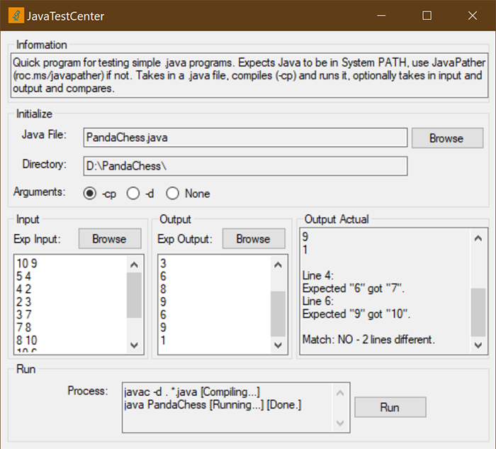

# JavaTestCenter

> Quick program for testing simple .java programs

## Description

Download: https://github.com/ReignOfComputer/JavaTestCenter/releases

Quick program for testing simple .java programs. Expects Java to be in System PATH, use [JavaPather](https://github.com/ReignOfComputer/JavaPather) if not. Takes in a .java file, compiles (-cp) and runs it, optionally takes in input and output and compares.

For a very specific use-case #CS2030 #CS2040.

  

## Usage

1. Select the .java file to run.
2. Select or write the input for when the program runs.
3. Select or write the expected output of the program.
4. Hit Run!

## Did It Work?

Let me know! Twitter: @ReignOfComputer

## License

[MIT License](https://github.com/ReignOfComputer/JavaTestCenter/blob/master/LICENSE) | &copy; 2019 ReignOfComputer